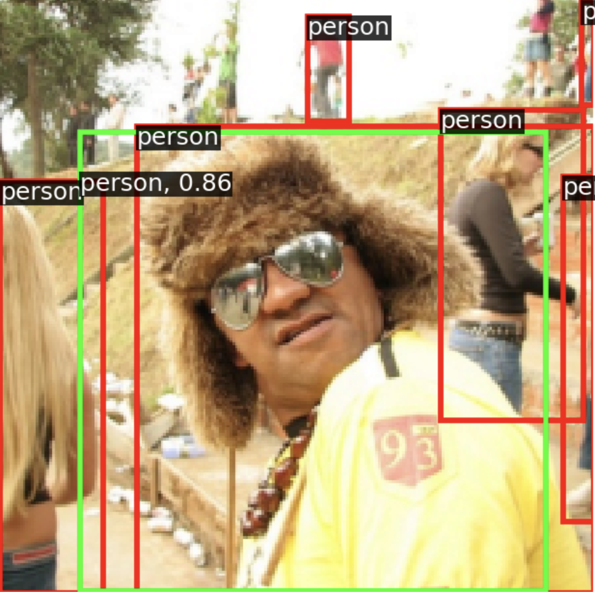

# FCOS detector

**Assignment points**: 1.5 (+0.5 bonus for the two stage detector)

**Deadline**: 23.10.2023 (11:00)

**Hard deadline** 24.10.2023 (11:00) (-0.1 point)

This assignment is from the University of Michigan [DL for CV course](https://web.eecs.umich.edu/~justincj/teaching/eecs498/WI2022/). Your task is to implement and train the FCOS detector https://arxiv.org/abs/1904.01355 (which we talked about in [lecture 2](../DL_2CV_04objectdetection_lec02.pdf)).

This homework is organized into multiple files:

- [`./fcos.ipynb`](./fcos.ipynb):  Notebook that will guide you through the implementation with the scoring at the end.
- [`./fcos.py`](./fcos.py): The file for the implementation.
- [`./lib`](./lib): Utilities and helper functions, you do not need to edit this file, but may have a look and understand it.

We recommend you to first write and debug code in your editor of choice locally (you may use the instructions to setup the environment from the [pytorch](../../week01-intro/pytorch.ipynb) notebook and then run training in colab. (*dont forget to upload the fcos.py file to the colab*, everything else should be there for you).

**Note**: You have to submit both ipynb and py files to anytask (separately, not as an archive).

# BONUS: Faster-RCNN detector

**Assignment points**: 0.5

**Deadline**: 30.10.2023 (11:00)

**Hard deadline**: 31.10.2023 (11:00)
Your task is to implement and train the [Faster-RCNN detector](https://arxiv.org/abs/1506.01497) (which we talked about in [lecture 1](../../week02-detection/DL_2CV_04objectdetection_lec01.pdf))

This homework is organized into multiple files:
- [`./fcos.py`](./fcos.py): The file you implemented in the main part of the homework.
- [`./lib`](./lib): Utilities and helper functions, you do not need to edit these files, but may have a look and understand them.
- [`./two_stage_detector.ipynb`](./two_stage_detector.ipynb):  Notebook that will guide you through the implementation with the scoring at the end.
- [`./two_stage_detector.py`](./two_stage_detector.py):  The file for the implementation.

Note: You have to submit both ipynb and py files to anytask (separately, not as an archive).
