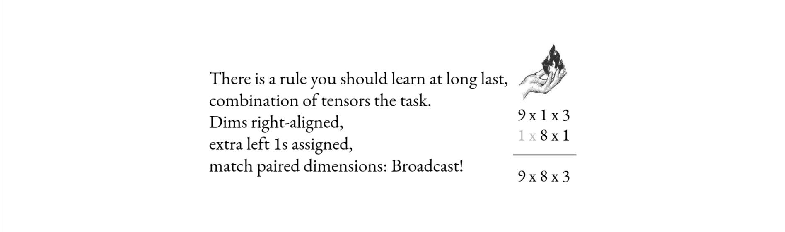
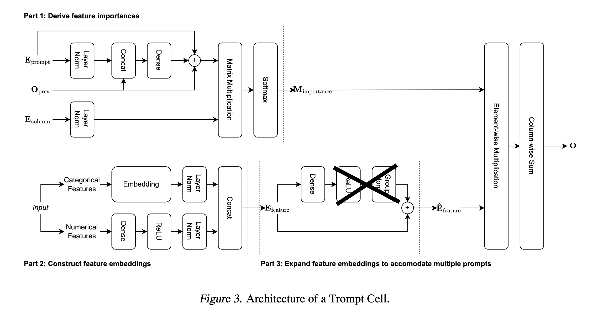

# Homework 01 - Tensor and DL Libraries 

The goal of this homework is to practice using PyTorch and get experience with profiling, running
multi-GPU training jobs in an almost real-world setup. 

Table of Contents:

1. [MiniTorch](#MiniTorch) Make your own PyTorch 
2. [Tensor Puzzles](#Tensor-Puzzles) Work on your broadcasting skills 
3. [Efficient Pytorch](#Efficient-Pytorch) Make a training job go fast 
4. [Grading](#tldr.-Grading-and-Deadlines) Info

## MiniTorch

https://minitorch.github.io 

This part is from an external DIY teaching library. You will need to write a tensor library with
automatic differentiation. Compared to the task from
[DL-1](https://github.com/isadrtdinov/intro-to-dl-hse/tree/2023-2024/homeworks-small/shw-01-mlp)
this one is more general (e.g. the library would allow you to write and differentiate any
computational graph, not just a sequential MLP). It mimics the structure of a modern tensor library
with autograd like PyTorch closer. Hopefully you'll understand PyTorch deeper as a result.

**Helpful Resources**:
- https://github.com/karpathy/micrograd 
- https://colah.github.io/posts/2015-08-Backprop

**Less Helpfull, but Fun**:
- https://jax.readthedocs.io/en/latest/notebooks/autodiff_cookbook.html 
- https://github.com/tinygrad/teenygrad
- https://huggingface.co/blog/joey00072/microjax
- https://arogozhnikov.github.io/2023/12/28/fastest-autograd.html

**Grading in Anytask**: Link to your completed minitorch module repository where all tests are
passing in the CI (GitHub actions)

- [**2pts**] [module-0](https://minitorch.github.io/module0/module0/) Basic intro to the test system and coding practices.
- [**2pts**] [module-1](https://minitorch.github.io/module1/module1/) Scalar automatic differentiation system.

Bonus Parts: 

- [**2pts**] [module-2](https://minitorch.github.io/module2/module2/) Tensor version of the library
- [**2pts**] [module-3](https://minitorch.github.io/module3/module3/) Efficiency improvements

## Tensor Puzzles

[original](https://github.com/srush/Tensor-Puzzles)

> When learning a tensor programming language like PyTorch or Numpy it is tempting to rely on the
> standard library (or more honestly StackOverflow) to find a magic function for everything. But in
> practice, the tensor language is extremely expressive, and you can do most things from first
> principles and clever use of broadcasting.

  

Broadcasting.

In the previous task we've built a simple tensor programming library with basic ops. In this task
we'll see how we can do many non-trivial computations using only the basic
operations like `arange`, indexing and broadcasting. We'll practice using broadcasting and tensor operations to implement

This is why tinygrad is so interesting. It has 25 low level op's and expresses all other
computations in terms of this small set of ops. As of 2024 tinygrad has the widest backend support
from AMD to Apple Metal and Qualcomm and can run most modern DL models. The caveat is that it's not
the fastest - e.g. CUDA PyTorch is significantly faster).

Tensor Puzzles Notebook:

**Grading in Anytask**: 

- **2pts** For the code with solved puzzles, that is passing all the tests (add notebook to anytask)
- Each puzzle is equal in terms of point distribution if you solve fewer than 21 puzzles.

## Efficient PyTorch

Writing efficient code is very important in DL. However, oftentimes you would need to read and optimize esoteric PyTorch (or else) code. 
You may encounter this at your work-place, maintaining some production system, or in research
scenarios - evaluating baselines or building on some research code.

This task takes inspiration from such occasions. You are given a script for
a slightly modified neural network for tabular data from an ICML
[paper](https://arxiv.org/abs/2305.18446) (Don't think too much of it, you'll see that the model is
complicated and slow -- perfect candidate to practice code optimization).

The [`train.py`](./train.py) file correctly implements the model from the following figure, the only
modification is in the expansion block where we thrown away all the non-linearities (this is
important for significantly optimizing this part of code). The code currently runs at ~14 objects
per second on one Kaggle T4 GPU. Your goal is to speed-it up approximately **500x**. You should use
Kaggle public notebooks with two T4 GPU's. The solution runs at ~7K objects per second.

  

Modified Trompt Architecture.

**Concept of a Plan**:
1. Profile the code (using PyTorch profiler, torch.utils.benchmark, print statements or your eyes)
2. Rewrite and improve the bottlenecks you've identified (e.g. rewrite some op's, without changing
   the computations - e.g. your modifications should not alter the model architecture or
   hyperparameters, only the computationally equivalent operations are allowed).
3. Use all of the efficiency gains that PyTorch provides (see helpful resources below for hints)
4. Document the process (gist, pdf, comment directly in anytask)
5. [*bonus part*] Compare performance on different hardware for different frameworks (e.g. make
   script work with TPUs on Kaggle with PyTorch and JAX and benchmark both, or do the same but with
   MLX or tinygrad on a MacBook instead of JAX and TPU).

**Helpful Resources**:
- https://pytorch.org/tutorials/recipes/recipes/profiler_recipe.html
- https://pytorch.org/tutorials/intermediate/torch_compile_tutorial.html
- https://pytorch.org/blog/accelerating-pytorch-with-cuda-graphs
- https://pytorch.org/docs/stable/amp.html
- https://pytorch.org/tutorials/recipes/recipes/tuning_guide.html
- https://sankalp.bearblog.dev/einsum-new

**Grading in Anytask**:
- [**2pts**] for the task for the ~100x speed-up (rewrite some ops) (part 1 and 2 above)
- [**2pts**] for the rest ~4-5x speed up (through multi-gpu training, amp, compile)
- [**4pts**] for the bonus part: other frameworks and hardware.

## tldr. Grading and Deadlines

https://anytask.org/course/1146/gradebook

**Materials and Cheating**:

You can use anything from the resources linked above. If you use any additional materials (e.g tutorial
posts, code examples) include references to your anytask report.

If you've used any LLM system, include your prompts/questions in additon to model answers
(e.g. it's ok to use LLMs, just as any reference materials from the internet, just be transparent
about it)

**Grades**:

- **4pts** for the MiniTorch (+ up-to **4pts** bonus). Proof: link to repos in anytask
- **2pts** for the Tensor Puzzles. Proof: notebook with finished puzzles and passed tests.
- **4pts** for efficient PyTorch (+ up-to **4pts** bonus). Proof: fast script and short report on what you've changed.

For the total of **10pts** with up to **8pts** bonus.

**Deadlines**:

There is one hard deadline for the homework `23:59 UTC+3 4.11.2024`

